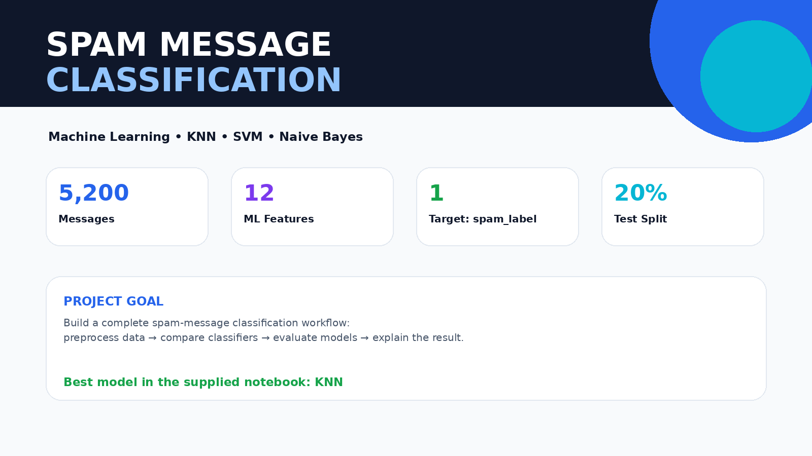
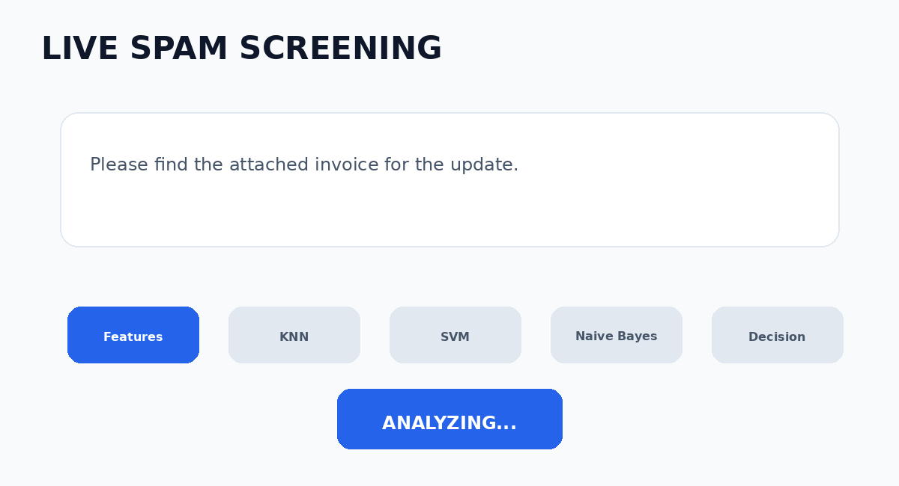
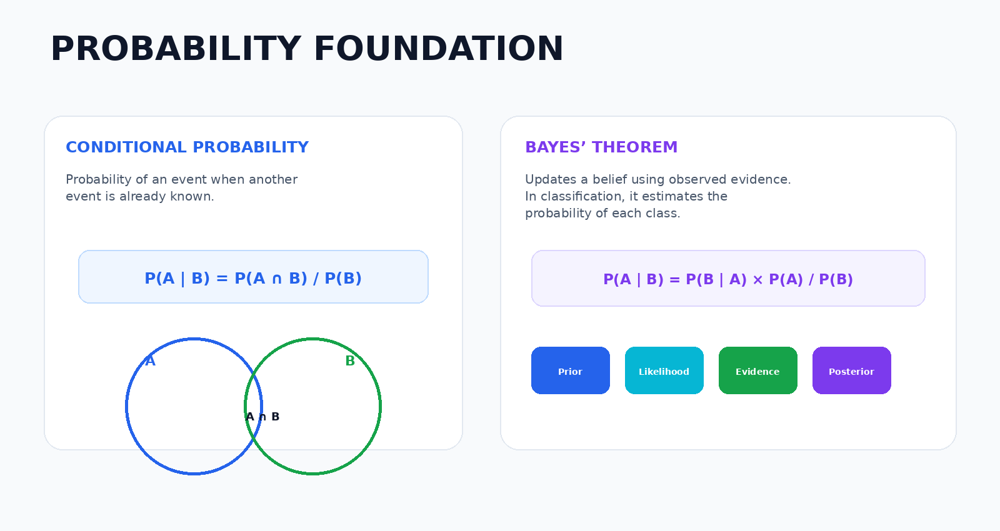
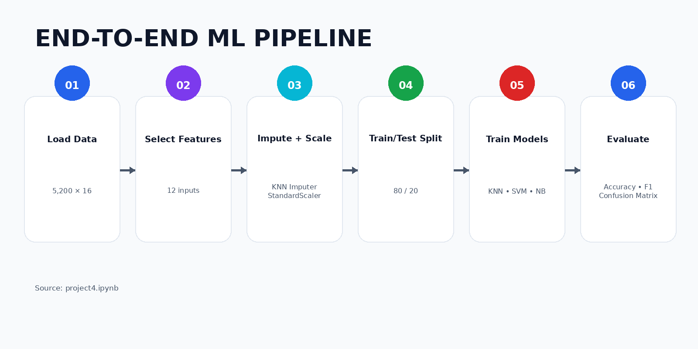
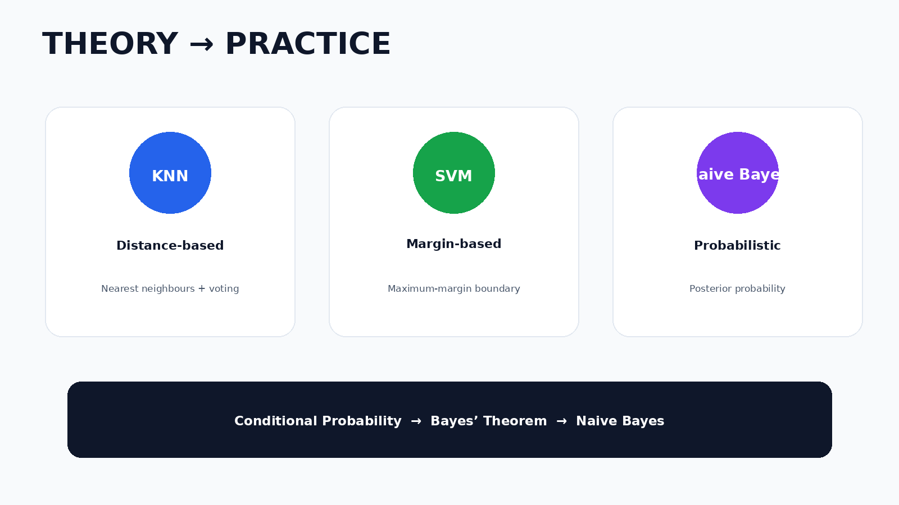
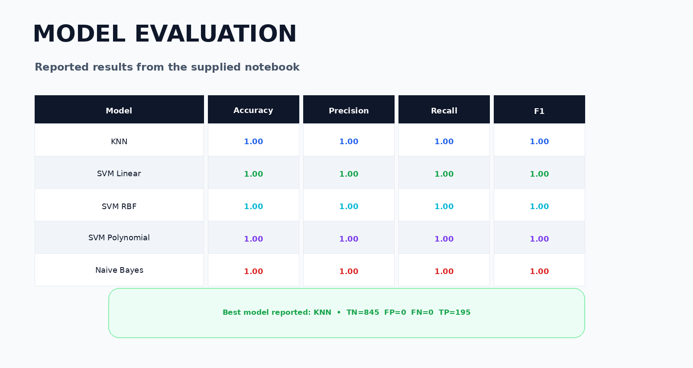

📩 Spam Message Classification — Machine Learning Project

  

  <b>End-to-End Spam Detection using KNN, SVM and Naive Bayes</b> 
  Probability foundations + preprocessing + model comparison + evaluation

  
  
  
  

🎬 Project Demo

  

🎯 Project Objective

This project builds a machine-learning workflow for identifying spam messages.

The supplied notebook uses a dataset of 5,200 records and 16 columns, selects 12 input features, and predicts spam_label. It covers preprocessing, train/test splitting, KNN, SVM, Naive Bayes, model comparison and confusion-matrix evaluation.

🧠 Probability & Classification Foundation

  

Conditional Probability

Probability of an event when another event is already known.

P(A | B) = P(A ∩ B) / P(B)

Bayes' Theorem

Updates probability using observed evidence.

P(A | B) = [P(B | A) × P(A)] / P(B)

Naive Bayes

Assumes that input features are conditionally independent given the class.

These concepts are the theoretical foundation of the probability-based section of the project.

🔄 Machine Learning Pipeline

  

Dataset

Rows: 5,200

Columns: 16

Target: spam_label

Input features: 12

Training data: 4,160 rows

Testing data: 1,040 rows

Split: 80/20, random_state=42, stratified

Preprocessing

Missing-value handling with KNNImputer(n_neighbors=5)

Feature scaling with StandardScaler

🤖 Models Used

  

🔵 K-Nearest Neighbors (KNN)

Distance-based classifier using nearest neighbours and majority voting.

The notebook tests K = 3, 5, 7, 9, 11 and selects K = 3 based on F1 score. Euclidean and Manhattan distances are also compared.

🟢 Support Vector Machine (SVM)

Margin-based classifier that searches for a strong separating decision boundary.

The project evaluates:

Linear kernel

RBF kernel

Polynomial kernel

🟣 Naive Bayes

Probability-based classifier using Gaussian Naive Bayes.

The project also demonstrates conditional probability and Bayes' Theorem using URL presence as evidence.

📊 Model Performance

  

Model

Accuracy

Precision

Recall

F1

KNN

1.00

1.00

1.00

1.00

SVM Linear

1.00

1.00

1.00

1.00

SVM RBF

1.00

1.00

1.00

1.00

SVM Polynomial

1.00

1.00

1.00

1.00

Naive Bayes

1.00

1.00

1.00

1.00

Best reported model: KNN

Confusion Matrix

TN: 845

FP: 0

FN: 0

TP: 195

Important: These are the results recorded in the supplied notebook. Perfect scores across every model are unusually strong, so the results should be checked for possible data leakage or overly easy feature separation before claiming production-level performance.

📈 Evaluation Metrics

Accuracy: overall correctness

Precision: how many predicted spam messages were actually spam

Recall: how many actual spam messages were detected

F1 Score: balance between precision and recall

For spam detection, Recall helps reduce missed spam, while Precision helps avoid incorrectly blocking legitimate messages.

💼 Business Recommendation

A practical spam filter should balance:

High Recall → catch more spam

High Precision → protect legitimate messages

Strong F1 → balance both

The supplied notebook recommends considering both recall and precision for the spam-detection business problem.

📁 Project Structure

Spam_Message_Classification_Project/
│
├── README.md
├── PART_A_THEORY.md
├── project4.ipynb
├── Message_Intelligence_Dataset_5200.csv   # add your dataset
│
└── assets/
    ├── 01_hero_spam_classification.png
    ├── 02_ml_pipeline.png
    ├── 03_theory_to_models.png
    ├── 04_probability_bayes.png
    ├── 05_model_evaluation.png
    └── 06_spam_classification_workflow.gif

▶️ How to Run

pip install pandas numpy matplotlib scikit-learn jupyter
jupyter notebook

Open project4.ipynb, keep Message_Intelligence_Dataset_5200.csv in the same folder, and run the notebook cells.

🏆 Key Learning Outcomes

Conditional Probability

Bayes' Theorem

Naive Bayes assumptions

KNN and distance metrics

SVM kernels and support vectors

Missing-value imputation

Feature scaling

Train/test splitting

Accuracy, Precision, Recall and F1

Confusion Matrix

Cross-validation

Model comparison

Business interpretation

⭐ Final Takeaway

This project connects theory with practical machine learning:

Conditional Probability → Bayes' Theorem → Naive Bayes

KNN → Distance-based classification

SVM → Margin-based classification

Evaluation → Precision + Recall + F1 + Confusion Matrix

The supplied notebook reports KNN as the best model and completes the requested classification workflow.

  <b>🚀 Built with Python • Pandas • NumPy • Scikit-learn • Jupyter Notebook</b>

